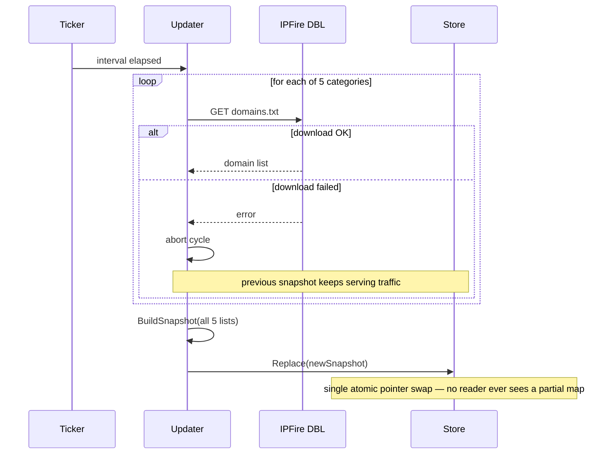

# Phoenix Domain Reputation API

**A fast, in-memory domain reputation API backed by the [IPFire Domain Blocklist](https://www.ipfire.org/dbl/how-to-use).**

[](LICENSE)
[](go.mod)
[](https://discord.com/invite/2BS7Z4FhJ)


- [Quick Start](#quick-start)
- [API](#api)
- [Configuration](#configuration)
- [Docker](#docker)
- [Contributing](#contributing)


---

## Table of Contents

- [Overview](#overview)
- [Architecture](#architecture)
- [Scoring](#scoring)
- [Quick Start](#quick-start)
- [Configuration](#configuration)
- [API](#api)
- [Update Behavior](#update-behavior)
- [Docker](#docker)
- [Testing](#testing)
- [Production Deployment Notes](#production-deployment-notes)
- [Contributing](#contributing)
- [Community & Support](#community--support)
- [License](#license)
- [Acknowledgments](#acknowledgments)

## Overview

Phoenix Domain Reputation API periodically downloads five [IPFire DBL](https://www.ipfire.org/dbl/how-to-use)
category lists — **gambling**, **malware**, **phishing**, **pornography**, and
**violence** — builds an in-memory reputation snapshot, and serves lookups
from memory. It is designed for hot-path use by mail and spam-filtering
systems: no database, no per-request network calls, no locks on the read
path.

- **Fast**: a lookup is one atomic pointer read and one map access.
- **Safe under load**: the background updater builds a full new snapshot
  off to the side and atomically swaps it in; readers never see a partial
  update.
- **Resilient**: a failed or partial IPFire download never replaces a good
  snapshot — the service keeps serving the last known-good data.
- **Simple**: standard library only (`net/http`, `log/slog`,
  `sync/atomic`) — no web framework, no ORM, no external database.

## Architecture

```mermaid
flowchart LR
    subgraph IPFire["IPFire DBL (external)"]
        L1[gambling]
        L2[malware]
        L3[phishing]
        L4[pornography]
        L5[violence]
    end

    subgraph Service["Phoenix Domain Reputation"]
        direction LR
        U["Updater\n(internal/updater)"]
        B["BuildSnapshot\n(internal/reputation)"]
        S[["Store\natomic.Pointer swap"]]
        H["HTTP API\n(internal/httpapi)"]
        U -->|"download all 5 lists"| B
        B -->|"all succeeded → publish"| S
        S -->|"store.Get(domain)"| H
    end

    IPFire -.->|periodic download| U
    H -->|JSON response| Client["Mail / spam-filtering service"]

    style S fill:#2563eb,color:#fff,stroke:#1e40af
```



The request path is exactly:

```go
reputation := store.Get(domain)
```

No database, no IPFire call, no lock contention — `Store.Get` is a single
`atomic.Pointer` load followed by a map read.

### Update cycle: all-or-nothing



### Package layout

| Package               | Responsibility                                                        |
|------------------------|-------------------------------------------------------------------------|
| `internal/ipfire`      | HTTP download, response size limits, list parsing, domain normalization |
| `internal/config`      | Environment-variable configuration, category → URL → score mapping     |
| `internal/reputation`  | Domain model, snapshot aggregation, atomic `Store`                     |
| `internal/updater`     | Periodic, all-or-nothing synchronization from IPFire into `Store`       |
| `internal/httpapi`     | `net/http` handlers — translate HTTP ⇄ `reputation` package, no logic  |

## Scoring

A domain's score is the sum of the scores of every category it appears in.
Duplicate entries within one category are only counted once.

```text
evil.com   in malware(5) + phishing(5)              → score 10
bad.com    in malware(5) + phishing(5) + violence(2) → score 12
gamble.com in gambling(2) only                        → score 2
example.com in no category                            → score 0
```

## Quick Start

```bash
git clone https://github.com/Yukthi-Systems/Phoenix-Domain-Reputation-API.git
cd Phoenix-Domain-Reputation-API
cp .env.example .env
go run ./cmd/server
```

Then, in another terminal:

```bash
curl http://localhost:8080/health
curl http://localhost:8080/ready
curl http://localhost:8080/v1/reputation/domain/example.com
```

Ready-to-run request collections are available in [`test/`](test/):
[`domain-reputation.http`](test/domain-reputation.http) (VS Code
[REST Client](https://marketplace.visualstudio.com/items?itemName=humao.rest-client))
and [`domain-reputation.postman_collection.json`](test/domain-reputation.postman_collection.json)
(Postman).

## Configuration

All configuration is via environment variables, optionally loaded from a
`.env` file (see [`.env.example`](.env.example) — copy it to `.env`, which
is git-ignored and never committed).

| Variable                   | Default | Description                                       |
|------------------------------|---------|-----------------------------------------------------|
| `SERVER_PORT`               | `8080`  | HTTP listen port                                    |
| `IPFIRE_UPDATE_INTERVAL`    | `1h`    | Interval between background updates (Go duration)   |
| `IPFIRE_HTTP_TIMEOUT`       | `30s`   | Per-request timeout for IPFire downloads            |
| `IPFIRE_GAMBLING_SCORE`     | `1`     | Score added when a domain is on the gambling list   |
| `IPFIRE_MALWARE_SCORE`      | `1`     | Score added when a domain is on the malware list    |
| `IPFIRE_PHISHING_SCORE`     | `1`     | Score added when a domain is on the phishing list   |
| `IPFIRE_PORNOGRAPHY_SCORE`  | `1`     | Score added when a domain is on the pornography list |
| `IPFIRE_VIOLENCE_SCORE`     | `1`     | Score added when a domain is on the violence list   |
| `LOG_LEVEL`                 | `INFO`  | `DEBUG`, `INFO`, `WARN`, or `ERROR`                 |

No variable here holds a secret — there is nothing to redact. Category
names, IPFire URLs, and their score environment variable are defined
together in [`internal/ipfire/categories.go`](internal/ipfire/categories.go)
(name + URL) and [`internal/config/config.go`](internal/config/config.go)
(env var + default), so adding or changing a category never touches
downloader or scoring logic.

## API

### `GET /health`

Liveness only. Always `200` once the process is up.

```json
{"status": "ok"}
```

### `GET /ready`

`200` once at least one IPFire snapshot has been published; `503` before
that. Point your orchestrator's readiness probe here, not at `/health`.

### `GET /v1/reputation/domain/{domain}`

```bash
curl http://localhost:8080/v1/reputation/domain/evil.com
```

```json
{
  "domain": "evil.com",
  "score": 10,
  "categories": [
    {"category": "malware", "score": 5},
    {"category": "phishing", "score": 5}
  ]
}
```

An unknown domain is **not** an API error — it returns `200` with score `0`
and an empty `categories` array. An invalid domain string returns `400`.
Input is normalized: `EVIL.COM.`, `evil.com`, and `evil.com.` all resolve
to the same result.

### `GET /v1/reputation/domain/{domain}/score`

Minimal response for very high-throughput consumers:

```json
{"domain": "evil.com", "score": 10}
```

### `POST /v1/reputation/domains`

```bash
curl -X POST http://localhost:8080/v1/reputation/domains \
  -H 'Content-Type: application/json' \
  -d '{"domains": ["evil.com", "example.com"]}'
```

```json
{
  "results": [
    {"domain": "evil.com", "score": 10, "categories": [{"category": "malware", "score": 5}, {"category": "phishing", "score": 5}]},
    {"domain": "example.com", "score": 0, "categories": []}
  ]
}
```

Capped at 1000 domains and a 1MB request body per call; unparseable
domain strings in the list are skipped rather than failing the whole
request.

## Update Behavior

At startup the server loads configuration, starts the HTTP server, runs
one synchronous IPFire update, then starts the periodic background
updater. If the very first update fails, the server still starts and keeps
returning `503` from `/ready` — it never pretends to be healthy with an
empty dataset. The periodic updater retries every
`IPFIRE_UPDATE_INTERVAL` and publishes a snapshot as soon as a cycle
succeeds.

Every cycle is **all-or-nothing**: all five category lists must download
and parse successfully before a new snapshot is built and published. If
any single category fails, the entire cycle is discarded and the previous
snapshot keeps serving traffic (see the [sequence diagram](#update-cycle-all-or-nothing)
above).

## Docker

```bash
docker build -t phoenix-domain-reputation .
docker run --rm -p 8080:8080 \
  -e IPFIRE_UPDATE_INTERVAL=1h \
  -e IPFIRE_MALWARE_SCORE=5 \
  phoenix-domain-reputation
```

Or with the published image and [`docker-compose.yml`](docker-compose.yml):

```bash
cp .env.example .env
docker compose up -d
```

The image (`rjyspl/phoenix-domain-reputation-api`) is a multi-stage build
producing a static binary on a minimal Alpine base, running as a non-root
process. No `.env` file is baked in — configuration is always injected at
container runtime. See [`DOCKERHUB.md`](DOCKERHUB.md) for the Docker Hub
overview.

## Testing

```bash
go test ./... -race -cover
go vet ./...
```

Tests should use `httptest.Server` and fakes rather than live network
access — the service must never depend on reaching the real IPFire
endpoints to pass CI. See [`CONTRIBUTING.md`](CONTRIBUTING.md) for the
expected coverage when submitting a change.

## Production Deployment Notes

- **Horizontal scaling**: the service is stateless aside from its
  in-memory snapshot, rebuilt from IPFire independently by every
  instance — safe to run many replicas behind a load balancer.
- **Readiness**: point a readiness probe at `/ready`, not `/health`, so
  traffic isn't routed to an instance before it has a snapshot.
- **Memory**: the five IPFire lists combined are on the order of
  millions of domains; budget a few hundred MB of RSS per instance and
  monitor as the lists grow.
- **Timeouts**: `IPFIRE_HTTP_TIMEOUT` bounds each category download; the
  HTTP server sets `ReadHeaderTimeout`, `ReadTimeout`, `WriteTimeout`, and
  `IdleTimeout` to guard against slow-client resource exhaustion.
- **Secrets**: none are required by this service. `.env` is for local
  development only, is git-ignored, and must never be committed — inject
  configuration via your platform's environment variable mechanism in
  production.
- **Graceful shutdown**: `SIGINT`/`SIGTERM` stop the updater and drain
  in-flight HTTP requests before exit.

## Contributing

Contributions are welcome — bug reports, documentation fixes, and pull
requests alike. Please read [`CONTRIBUTING.md`](CONTRIBUTING.md) and our
[`CODE_OF_CONDUCT.md`](CODE_OF_CONDUCT.md) before opening a PR. Security
issues should be reported privately per [`SECURITY.md`](SECURITY.md),
not as a public issue.

## Community & Support

<p>
  💬 Chat with the community on
  <a href="https://discord.com/invite/2BS7Z4FhJ" target="_blank" rel="noopener noreferrer">Discord</a><br/>
  ✉️ Reach the maintainers at
  <a href="mailto:connect@yukthi.com">connect@yukthi.com</a>
</p>

## License

Licensed under the [GNU General Public License v3.0](LICENSE).

## Acknowledgments

- [IPFire Project](https://www.ipfire.org/) for maintaining and publishing
  the [Domain Blocklist](https://www.ipfire.org/dbl/how-to-use) this
  service consumes.
